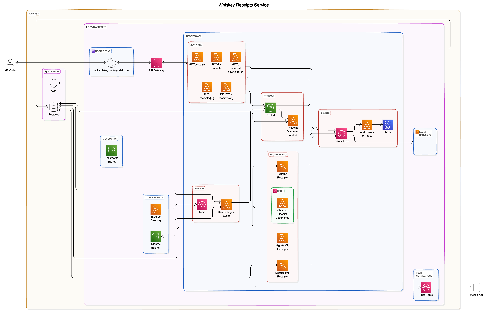

# Whiskey - Receipts Service

A Serverless CRUD API for managing Receipts.

> This is actively being re-architected to simplify the code and align with an EventBridge
> event-sourcing system - but feel free to look around at the current state!

## Use Cases

- Automatic Receipt extractors can make POST requests to add their outputs to the centralized
  database
- Mobile Receipt scanners can make POST requests to add scans to the centralized database
- Mobile Document viewers can make GET requests to retrieve historical receipts.

## Architecture

## Stack

- Supabase - Database, Auth
- Amazon DynamoDB - Event Store
- Amazon SNS - Events
- AWS Lambda (Node.js) - Backend Logic
- Amazon S3 - File Storage
- Amazon API Gateway - API Infrastructure
- SST v2 (based on AWS CDK) - Infrastructure-as-Code
